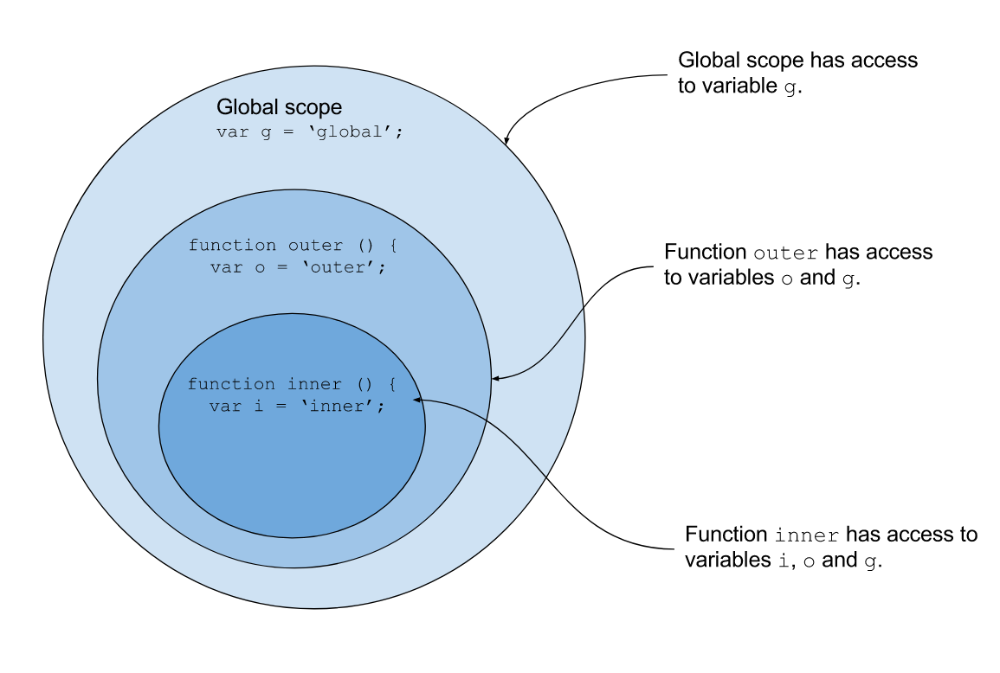

# JavaScript Core 2
** What will we learn today?**
- Taking functions further
- What is `this`?
- Scope
- Closures

---

# Taking functions further
You've been working with functions for a few weeks now. Today we're going to dive deeper into working with functions, and cover some more advanced concepts.

## 'Fat arrow' functions
ES6 introduced a new way of structuring functions; the arrow function. Let's compare it against the ES5 syntax:

```js

// ES5
var multiply = function(x, y) {
  return x * y;
};

// ES6
multiply = (x, y) => { return x * y };

console.log(multiply(2, 3));

```

Arrow functions are quicker to write because they don't require variable assignment. Also, if you're only passing one argument into the arrow function, you don't need to use brackets around the parameter:

```js
multiplyByTen = num => { return 10 * num };

console.log(multiplyByTen(5));
```

If you're only going to `return` a single line in an arrow function, you don't even need the curly brackets (or the `return` keyword):

```js
greet = name => `Hello, I am ${name}!`;

console.log(greet('Ada Lovelace'));
```

However, there are some important differences between arrow functions and ES5 functions aside from syntax. Try the following exercise:

> **Exercise**: Always have exercises

# Scope

Before we get into what scope is, let's try a little exercise.

Open up jsbin and write the following:

```js
var firstFunction = function() {
  var a = 10;

  var secondFunction = function() {
    console.log(a);
  }

  secondFunction();
};

firstFunction();
```

This should work fine, and the console should print `10`. But what if we swap the positions of `var a` and the `console.log()`?

```js
var firstFunction = function() {
  console.log(a);

  var secondFunction = function() {
    var a = 10;
  }

  secondFunction();
};

firstFunction();
```

This returns an error: `ReferenceError: a is not defined`. You might think that the problem is that we're trying to console log `a` before it's declared in the code order. So let's try putting the `console.log(a)` after `secondFunction`, where `a` is assigned:

```js
var firstFunction = function() {

  var secondFunction = function() {
    var a = 10;
  }

  console.log(a);

  secondFunction();
};

firstFunction();
```

Wait, we're still getting the `ReferenceError`! Even if we move the `console.log(a)` underneath where `secondFunction` is called, we _still_ get the error. What's going on?

What we're seeing here is the effect of **scope**. Take a look at the following diagram:




We can see from this picture that each function is like a 'bubble', and it has access to the variable assigned within it, and the variables assigned 'above' it, in it's surrounding function. But note that the 'global' scope doesn't have access to `var o`, and `function outer()` doesn't have access to `var i`. So each function can access the variables in its **parent scope**, and in it's **own, immediate scope**, but it cannot see the variables in its **child scope**.


> **Exercise**: Always have exercises

# Topic 3
> **Exercise**: Always have exercises


# Resources
1. [Resource 1 to learn more about Topic 1](https://google.com)
2. [Resource 2 for Topic 2](https://google.com)

# Homework

1. First part of Homework - Easy

2. Second part of Homework - Intermediate/Hard

3. **[Bonus/Optional]** Third part/optional - Hardest

4. **Research:**

## Prepare for the next class
1. Read this [Some Tutorial or Video etc...](https://google.com)
