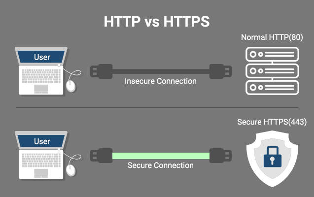

# Node 3

** What we will learn today?**

* [Node Recap](#node-recap)
* [Advanced Topics](#advanced-topics)
* [Hotel Workshop](#hotel-workshop)

---

## Node Recap

Javascript has evolved from the browser to be used in the backend. It does not need a framework as we saw in [week-13](../week-13/lesson.md), however a framework like Express allows us to develop faster.

### Documentation

When you are working with frameworks it is always helpful to use their documentation.

* [Express Documentation](https://expressjs.com)
* [Node.js Documentation](https://nodejs.org/api/http.html)

### Middleware

Middleware allow us to process requests to add functionalities that are not built in to Express, for example logging, authentication, etc.

> * Express Documentation: [Using Middleware](https://expressjs.com/en/guide/using-middleware.html)
> * Video: [body-parser](https://www.youtube.com/watch?v=vKlybue_yMQ) which makes it easier to work with POST requests and forms.

### Routing

Routing refers to how an application’s endpoints (URIs) respond to the client requests. These are configured differently for each framework, and can range from basic configuration to very extensive for more complex use cases.

Simple example

```js
app.get("/", function(req, res) {
  res.send("hello world");
});
```

More complicated example using `Passport.js` middleware for authentication

```js
function ensureAuthenticated(req, res, next) {
  if (req.isAuthenticated()) return next();
  else res.redirect("/login");
}

app.get("/account", ensureAuthenticated, function(req, res) {
  res.send("welcome user!");
});
```

> * Express Documentation: [Routing](https://expressjs.com/en/guide/routing.html)

## Advanced Topics

### Performance

Express have their own recommended [best practices page](https://expressjs.com/en/advanced/best-practice-performance.html)

### Node Process Managers

These process managers monitor for any changes in your node.js application and automatically restart the server, perfect for development and production.

> Popular PMs include:
>
> * [nodemon](http://nodemon.io/)
> * [pm2](https://expressjs.com/en/advanced/pm.html#pm2)

### REST

REST is a convention of how to design your API, whether it is for your own frontend, or other frontends and clients.

> * Read: Resource naming in [REST](http://www.restapitutorial.com/lessons/restfulresourcenaming.html) convention

### Security

When you take your website to production there is a whole range of things to consider.



### Authentication

Sometimes you need to add user functionality for your website. To do this you can make use of external libraries like [passport](www.passportjs.org) to add authentication to your website.

> For more information read:
>
> * [OAuth 2.0 Authorization Framework: Bearer Token Usage](https://tools.ietf.org/html/rfc6750)
> * [Bearer Strategy](https://github.com/jaredhanson/passport-http-bearer)

## Hotel Workshop

Get in to groups of 3/4 and checkout the [workshop brief](./workshop.md).

> **Exercise**: Please fork and clone [CYF-Hotel](https://github.com/CodeYourFuture/cyf-hotel) repository and follow the exercises in the `README.MD`.




