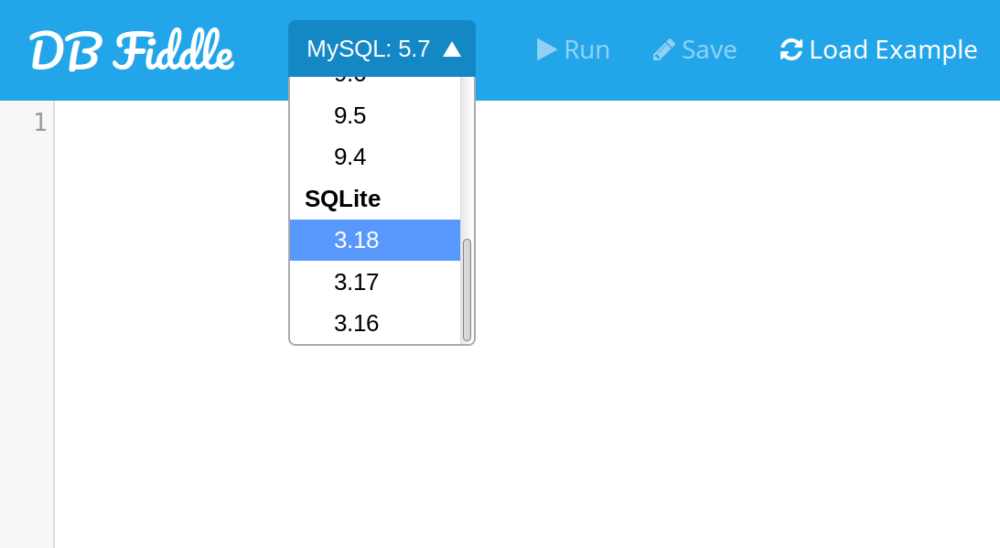

# WEEK 16 LESSON 1 : BASIC SQL

**What we will learn today?**

* Why we need databases.
* Creating a database with SQL, storing data in it.
* Retrieving data from a database using SQL.
* Inserting data into a database using SQL.
* Joins

THE PROBLEM
-----------

Start by checking out https://github.com/CodeYourFuture/cyf-hotel

Go to API end point for add reservation.

* Take existing code that stores reservation as a JSON snippet with subkeys for customer and rooms.

* Put in null for customer id and room id.

* Ask what actually happend when the guests 1) make a reservation (nothing out of the ordinary) and 2) check in.

* [ FIND A PICTURE OR GIF OF A CHAOTIC HOTEL LOBBY ]

* Ask students how to solve this problem?

- If you try to enter invalid data into your program what should your program do? [ ANSWER : FAIL ]

* How do you make your program fail? [ Unit tests is an answer. Johnnny the junior programmer didn't actualyl write any. Tommy senior was too lazy. ]

* Explicit validation in one way to do it. Ideally this is a requirement that you embed.

THE SOLUTION
------------

The database is a way to enter structured data in a way that cannot easily be violated.

The way we use a database is completely different to the way we store things in files.
- Files just store the data, and the program needs to open, close, retrieve, store or modify everything itself. All the responsabilities are on the side of the program
- A Database is stored under an Relational Database Management System (RSGBD), which enforces:
    - data constraints (E.g. required fields, data types, uniqueness of identifiers)
    - executes on a different process/machine, meaning that the queries can be parallelized, and work can be offloaded from the main program.

This lesson will be about taking what you have stored in a file currently and changing it such that it is stored in a database instead. Everything will look like it works exactly the same as before. But your software will be safer.

```
{
  "reservation id"
  "date"
  "customer": {
      "name": "blah",
      "last name": "blah",
  "room": {
      "thing"

}
```

We're going to teach you a new programming language.
It's called SQL. Pronounced "S - Q - L" or sequel,
as in "the sequel to the original 3 stars films were
awful."

It's used for two things:

* Storing data in a database
* Retrieving data from a database

## Create a Database

Students, first open up your browsers and visit [DB Fiddle](https://www.db-fiddle.com/).

Then, select SQLite:



### How to create a table:

First thing we want to store is customers, since without customers,
you don't have a hotel.

```
CREATE TABLE customers (
    title     VARCHAR,
    firstname VARCHAR,
    surname   VARCHAR,
    email     VARCHAR,
);

```

Exercises:
- CREATE TABLE Rooms
- CREATE TABLE Customers

### How to insert into a table
```
INSERT INTO Customer
```

Exercises:
- INSERT INTO Room (with ID of 6)
- INSERT INTO Reservation

** Add a couple of customers, some of which with the same name/other columns
** Add Colm >> OConner << as one of the users

### How to extract data

Start with select from single table

```
SELECT * FROM Customer
```

Exercise:
- SELECT on Reservation
- SELECT on Room


#### Add the filtering

```
SELECT * FROM Customer WHERE something
```

Exercise:
- SELECT AND WHERE ROOM price > 50
- SELECT WHERE checkout date is between next thursday and sunday

*** Filter by name so that we can highlight the name ambiguity ***

*** Highlight the issue with multiple customers with the same name that cannot be distinguished properly when querying. ***


#### Deal with name ambiguity

- Remove existing table `DROP table`

Q: how could we deal with this issue?

A: Primary key to eliminate ambiguity

E.g. Passports and Driver's lisences have unique ids, because people can have same names and even be born on the same day.

We could in principle use one of these real unique identifiers, but they are not always available.

- Add autoincrementing ids to solve the problem and recreate table.
- Re-insert the same users


Q: What makes a good primary key?

A: passport, driver's lisence, auto generated identifiers

### Update data

We need to chane the data to fix misspelled name of Teacher. Colm. whose name is set originall in the databse to be be 'Oconner'

```
UPDATE Client set surname = 'O\'Connor' Client WHERE id = 1;
```


### Joining tables in SELECT


// DIAGRAM WHEN WE EXPLAIN IT

```
SELECT * from Reservation JOIN Customer - reservations associated with customers
```

Exercise:
- SELECT AND JOIN - reservations for a particular room
- SELECT AND JOIN - mix join AND where

As an exercise: SELECT AND JOIN - rooms associated with reservations


